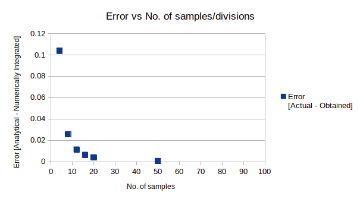
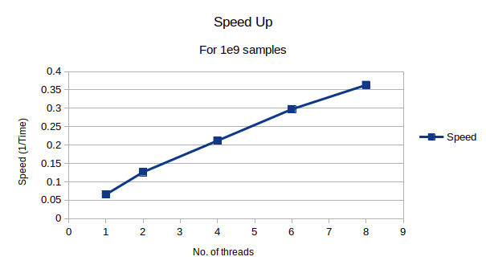
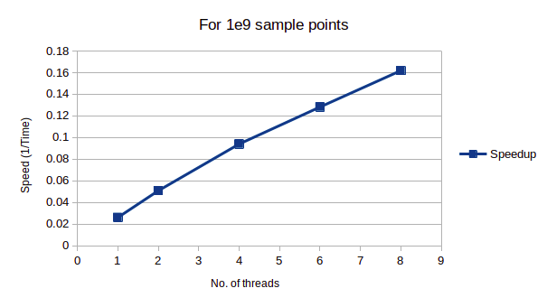
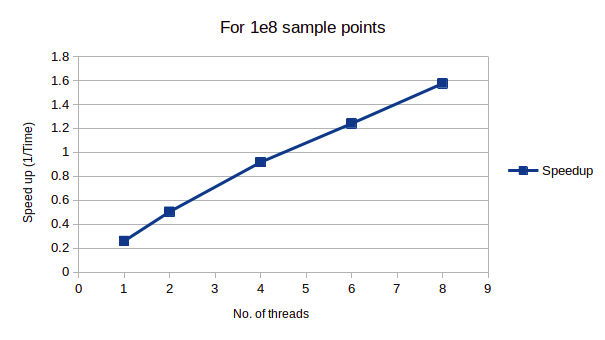

## Numerically integrate cos(x)

1st March 2021

#### OVERVIEW

```
Considering a function f (x) = cos(x) in the interval [− pi/2 , pi/2 ].
Writing serial and OpenMP parallel codes to numerically integrate the
function using the
(a) Trapezoidal Rule
(b) Montecarlo Method

```
#### GOALS 

```
1.  To perform a convergence study, using different numbers of divisions
    (or sampling points), by comparing the integral obtained through the
    numerical methods with the analytical integral.
2.  To perform a timing study using 2, 4, 6 and 8 OpenMP threads and
    reporting average times of at least 5 runs of the code.

```

## Solving Integration 


Analytical integral 
Integrating cos(x) in the interval [− pi/2 , pi/2 ] as follows,

\
\
\
 =   2


## Trapezoidal Rule 


Let we partition  into n equal subintervals, each
of width 

The Trapezoidal Rule for approximating is given
by,

  …….……………(1)

where  is the sampling point.

#### Algorithm


-   Initialise the number of divisions/samples points for the
    Trapezoidal Rule.
-   Initialise the starting of the current sample as
    .
-   Initialise the step size,  as
    .
-   Iterate the current sample point as  for all
    sample points till  .
-   Compute the result by accumulating the value of
     for every sample point such that
     according to equation (1).
-   Storing the result of integration as the multiplication of step size
     and the accumulation of
    function.
-   To parallelise the code, use \#pragma omp parallel for
    reduction(+:) before the iteration loop in
    step 4.


#### Conclusions

```
-   As the number of sampling points increases, the error reduces as
    shown in Figure1.
-   As the number of cores increases, the time to solve reduces as shown
    in  Figure2.

```



## Monte-carlo Method 

```
In the trapezoidal rule of numerical integration, a deterministic
approach is used. However, Montecarlo integration employs a
non-deterministic approach where each realization provides a different
outcome.

```
#### Algorithm


-   Initialise the number of samples points for the Montecarlo Method.
-   Initialise .
-   Initialise the total area as the multiplication of
    .
-   Initialise the seed for random function generation i.e.
    rand\_r(&seed).
-   Iterate a loop for the number of sample points and using the random
    number generator function call find the number of x and y-axis
    samples with-in the range corresponding to .
-   Compute and accumulate a variable called, hits if the cos(x) \> y
    for all samples generated in the above step. Also, compute and
    accumulate all the iterations as all\_samples\_count.
-   Calculate the ratio of hits as  , The result
    of integration will be .
-   To parallelise the code, use \#pragma omp parallel for private
    (iterator, seed) reduction(+:hits, all\_samples\_count) before the
    iteration loop in step 5.


#### Conclusions

```
-   As the number of sampling points increases, error reduces 
-   As the number of cores increases, the time to solve reduces as shown
    in  Figure 3&4.
-   With the thread-safe variant i.e rand\_r(), we are making seed as a
    private variable amongst threads to ensure the state is not shared
    between threads. It makes the sequences independent of each other.
    If we start them with private seeds, we will get different sequences
    in all threads. This is the reason why we are observing different
    results for the different number of threads.

```
 
 


